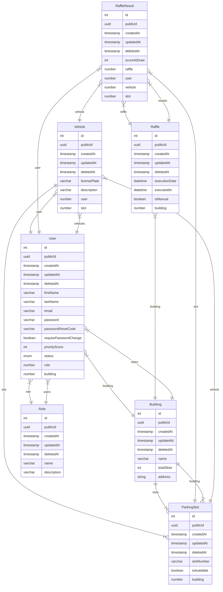

# Database Design Document

This document is auto-generated. Do not edit manually.

### Entity Relationship Diagram

```mermaid
erDiagram
    Vehicle {
        int id
        uuid publicId
        timestamp createdAt
        timestamp updatedAt
        timestamp deletedAt
        varchar licensePlate
        varchar description
        number user
        number slot
    }
    Vehicle }|--|| User : "user"
    Vehicle ||--|{ ParkingSlot : "slot"
    ParkingSlot {
        int id
        uuid publicId
        timestamp createdAt
        timestamp updatedAt
        timestamp deletedAt
        varchar slotNumber
        boolean isAvailable
        number building
    }
    ParkingSlot }|--|| Building : "building"
    ParkingSlot ||--|{ Vehicle : "vehicle"
    Building {
        int id
        uuid publicId
        timestamp createdAt
        timestamp updatedAt
        timestamp deletedAt
        varchar name
        int totalSlots
        string address
    }
    Building ||--|{ User : "users"
    Building ||--|{ ParkingSlot : "slots"
    Role {
        int id
        uuid publicId
        timestamp createdAt
        timestamp updatedAt
        timestamp deletedAt
        varchar name
        varchar description
    }
    Role ||--|{ User : "users"
    User {
        int id
        uuid publicId
        timestamp createdAt
        timestamp updatedAt
        timestamp deletedAt
        varchar firstName
        varchar lastName
        varchar email
        varchar password
        varchar passwordResetCode
        boolean requirePasswordChange
        int priorityScore
        enum status
        number role
        number building
    }
    User }|--|| Role : "role"
    User }|--|| Building : "building"
    User ||--|{ Vehicle : "vehicles"
    RaffleResult {
        int id
        uuid publicId
        timestamp createdAt
        timestamp updatedAt
        timestamp deletedAt
        int scoreAtDraw
        number raffle
        number user
        number vehicle
        number slot
    }
    RaffleResult }|--|| Raffle : "raffle"
    RaffleResult }|--|| User : "user"
    RaffleResult }|--|| Vehicle : "vehicle"
    RaffleResult }|--|| ParkingSlot : "slot"
    Raffle {
        int id
        uuid publicId
        timestamp createdAt
        timestamp updatedAt
        timestamp deletedAt
        datetime executionDate
        datetime executedAt
        boolean isManual
        number building
    }
    Raffle }|--|| Building : "building"
    Raffle ||--|{ RaffleResult : "results"
```
