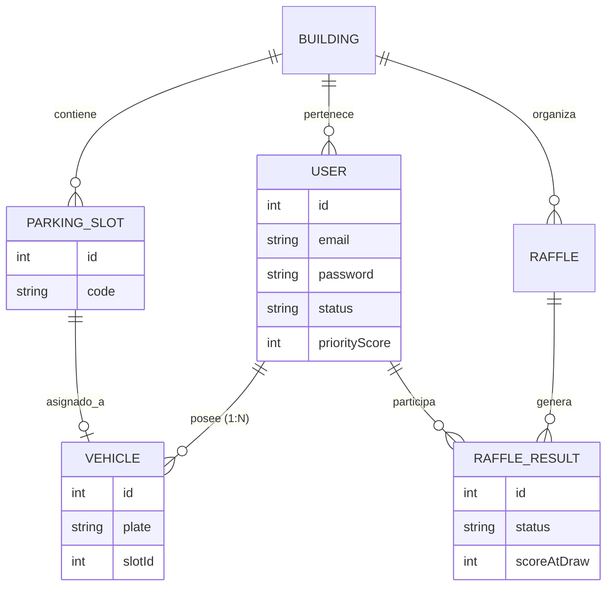

# 📑 Parking Management System Documentation (PoC)

## 1. Executive Summary

This system is a comprehensive solution for the automated management of parking spaces in residential or corporate environments. Unlike simple random assignment, this PoC implements an **Equitable Selection Engine** based on priority scores, ensuring that access to the resource (parking) is distributed fairly over time.

---

## 2. Roles & Hierarchy Architecture

A Role-Based Access Control (**RBAC**) has been implemented with a hierarchical structure to allow for multi-tenant scalability:

| Role         | Scope        | Key Functions                                                                       |
| :----------- | :----------- | :---------------------------------------------------------------------------------- |
| **ROOT**     | Global       | Building (Tenant) management, Administrator management, and global audit oversight. |
| **Admin**    | Per Building | Resident management, manual raffle execution, and local assignment supervision.     |
| **Resident** | Personal     | Inquiry of assignment status, personal history, and profile management.             |

---

## 3. Data Model & Core Entities

The database was designed under normalization principles, prepared for complex relationships:

### Entity-Relationship Diagram (ERD)

---

## 4. The Raffle Engine: Equity Logic (Priority Score)

The core of the system solves the \"consecutive luck\" problem through an **Accumulative Weighting** algorithm.

### Assignment Scenarios:

1.  **Supply > Demand:** Direct linear assignment.
2.  **Demand > Supply:** The priority engine is activated:
    - **Priority Score ($P$):** Every time a user with a registered vehicle does **not** win a spot, their $P$ increases by 1.
    - **Probability:** In the next raffle, users with a higher $P$ have absolute priority over those with a lower score.
    - **Reset:** Upon winning a spot, the user's $P$ is reset to 0.

### History Result States:

To ensure transparency, every raffle execution (automatic every 3 months or manual) generates immutable records with the following states:

- **WINNER:** Secured a slot. The specific slot code (e.g., `S-001`) is recorded.
- **LOSER:** Did not secure a slot. The priority increment is recorded.
- **EXCLUDED:** Active resident but without a registered vehicle (does not participate).

---

## 5. Security Flows & User Experience (UX)

### A. Access & Credential Management

- **Provisioning:** The system generates secure random passwords when registering new users.
- **Mandatory Onboarding:** A \"First Login Hook\" was implemented. Users must change their temporary password before accessing any functionality, ensuring account integrity.
- **Secure Recovery:** Password reset flow via OTP codes sent by email.
  - _Technical Note:_ In `development` environments, the code is pre-filled for testing efficiency, but the messaging service is decoupled for production.

### B. Parking Lifecycle

- **Inventory Immutability:** Parking spots are generated upon building creation (based on total capacity) and assigned a unique identifier. This prevents manual inventory manipulation during draws.
- **User Status:** The `status` field allows for disabling residents (e.g., due to non-payment or relocation), automatically excluding them from future raffles without deleting their historical records.

---

## 6. Scalability Considerations (Technical Roadmap)

The PoC includes the foundation for future phases:

1.  **Multi-Vehicle Support:** The $1:N$ relationship between User and Vehicle allows residents to choose which vehicle to participate with or assign priorities between them in the future.
2.  **True Multitenancy:** Through the **ROOT** role, the database can segment information from hundreds of buildings in an isolated manner.
