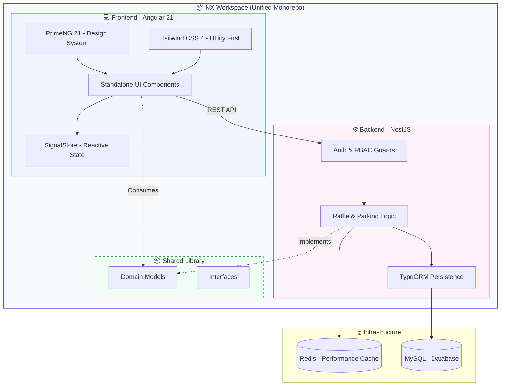

# Architecture diagram.

```mermaid
flowchart TD
    subgraph NX_Monorepo ["📦 NX Workspace (Unified Monorepo)"]
        direction TB

        subgraph FE ["💻 Frontend - Angular 21"]
            A[PrimeNG 21 - Design System]
            B[Tailwind CSS 4 - Utility First]
            C[SignalStore - Reactive State]
            A & B --> D[Standalone UI Components]
            D --> C
        end

        subgraph BE ["⚙️ Backend - NestJS"]
            E[Auth & RBAC Guards]
            F[Raffle & Parking Logic]
            G[TypeORM Persistence]
            E --> F --> G
        end

        subgraph Shared_Libs ["📦 Shared Library"]
            H[Domain Models]
            I[Interfaces]
        end

        %% Cross-dependencies
        D -.->|Consumes| H
        F -.->|Implements| H
        D -->|REST API| E
    end

    subgraph Data_Layer ["🗄️ Infrastructure"]
        J[(Redis - Performance Cache)]
        K[(MySQL - Database)]
        F --> J
        G --> K
    end

    %% Estilos de marca y claridad
    style NX_Monorepo fill:#f8f9fa,stroke:#4f46e5,stroke-width:2px,color:#333
    style FE fill:#eff6ff,stroke:#2563eb
    style BE fill:#fdf2f8,stroke:#db2777
    style Shared_Libs fill:#f0fdf4,stroke:#16a34a,stroke-dasharray: 5 5


```
